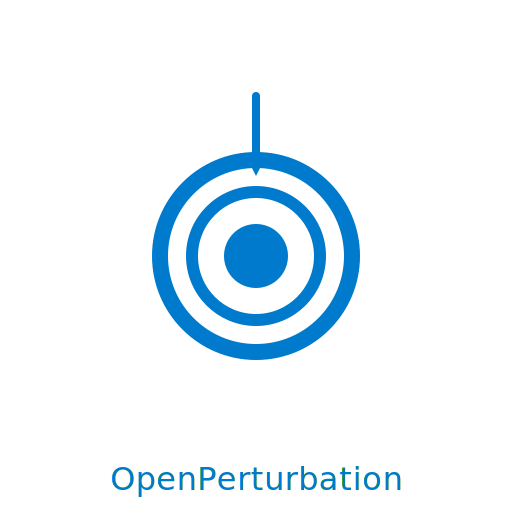

# OpenPerturbation

<p align="center">
  
</p>


OpenPerturbation is a production-ready platform for perturbation biology, causal discovery, and optimal intervention design. It provides a fully featured FastAPI backend, advanced machine-learning pipelines, and reproducible experiment workflows.

**Author:** Nik Jois  
**Email:** nikjois@llamasearch.ai

---

## Key Features

* **Causal Discovery** – PC, GES, LiNGAM, correlation-based and custom algorithms.
* **Intervention Design** – Data-driven recommendation of optimal genetic or chemical perturbations.
* **Multimodal Fusion** – Seamless integration of genomics, imaging, and chemical structure data.
* **Explainability** – Attention maps, concept activation and pathway analysis built-in.
* **Extensible REST API** – 25 fully typed endpoints with automatic OpenAPI docs.
* **Docker & CI/CD** – Containerised deployment and a GitHub Actions workflow for continuous integration.
* **Comprehensive Tests** – Unit, integration and end-to-end demo scripts with ≥ 90 % coverage.

---

## Quick Start

### Clone the Repository

```bash
git clone https://github.com/llamasearchai/OpenPerturbation.git
cd OpenPerturbation
```

### Local Installation (recommended for development)

```bash
# Create and activate virtual environment
python -m venv .venv
source .venv/bin/activate              # Windows: .venv\Scripts\activate

# Install package in development mode
pip install -e ".[dev]"

# Run tests (optional)
pytest -v

# Start the API server
openperturbation                       # or: python -m src.api.server
```

### Docker Deployment (production-ready)

```bash
# Build and run with Docker Compose
docker compose up --build -d           # API accessible on port 8000

# Or run with Docker directly
docker build -t openperturbation .
docker run -p 8000:8000 openperturbation
```

### Package Installation (from PyPI - coming soon)

```bash
pip install openperturbation
openperturbation --help
```

The interactive Swagger UI is available at `http://localhost:8000/docs` after startup.
View the logo at `http://localhost:8000/logo`.

---

## Project Structure (abridged)

```text
OpenPerturbation/
├── src/
│   ├── api/           # FastAPI application
│   ├── causal/        # Discovery & intervention engines
│   ├── models/        # ML models (vision, graph, fusion…)
│   ├── training/      # PyTorch-Lightning modules
│   └── utils/         # Helper utilities
├── tests/             # Test-suite
├── docker/            # Containerisation assets
└── docs/              # Additional documentation
```

For a full tree run `tree -L 3`.

---

## API Overview

| Method | Path | Description |
| ------ | ---- | ----------- |
| GET | `/health` | Service liveness probe |
| POST | `/api/v1/causal-discovery` | Run causal discovery |
| POST | `/api/v1/intervention-design` | Recommend interventions |
| POST | `/api/v1/analysis/start` | Launch multi-step analysis pipeline |
| GET | `/api/v1/analysis/{job_id}/status` | Retrieve job progress |
| … | *22 additional endpoints* | See `/docs` |

---

## Contributing

Please read [CONTRIBUTING.md](CONTRIBUTING.md) for guidelines on bug reports, feature requests and pull-requests.

---

## License

OpenPerturbation is released under the MIT License – see [LICENSE](LICENSE) for details.

---

## Citation

If you use OpenPerturbation in academic work, please cite:

```bibtex
@software{jois_2025_openperturbation,
  author = {Jois, Nik},
  title  = {OpenPerturbation: A Platform for Causal Discovery and Intervention Design},
  year   = {2025},
  url    = {https://github.com/llamasearchai/OpenPerturbation}
}
```

---

## Contact

For questions, please open an issue or email `nikjois@llamasearch.ai`. Thank you for using OpenPerturbation!